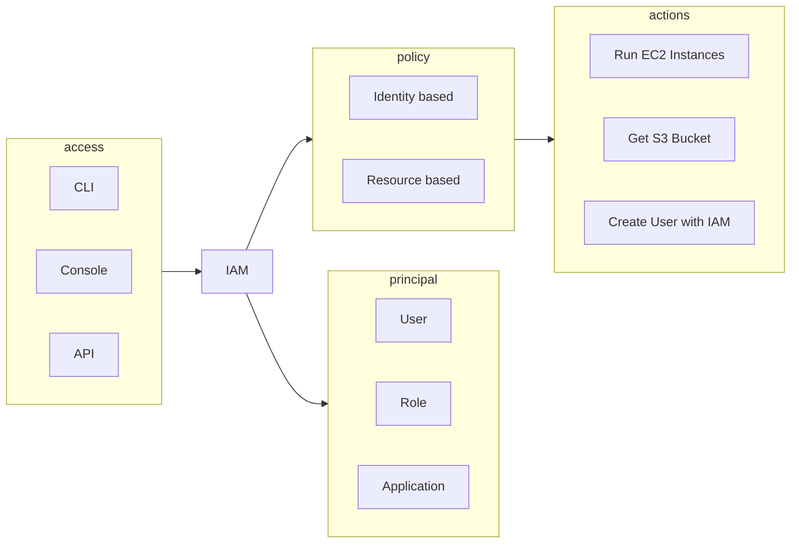
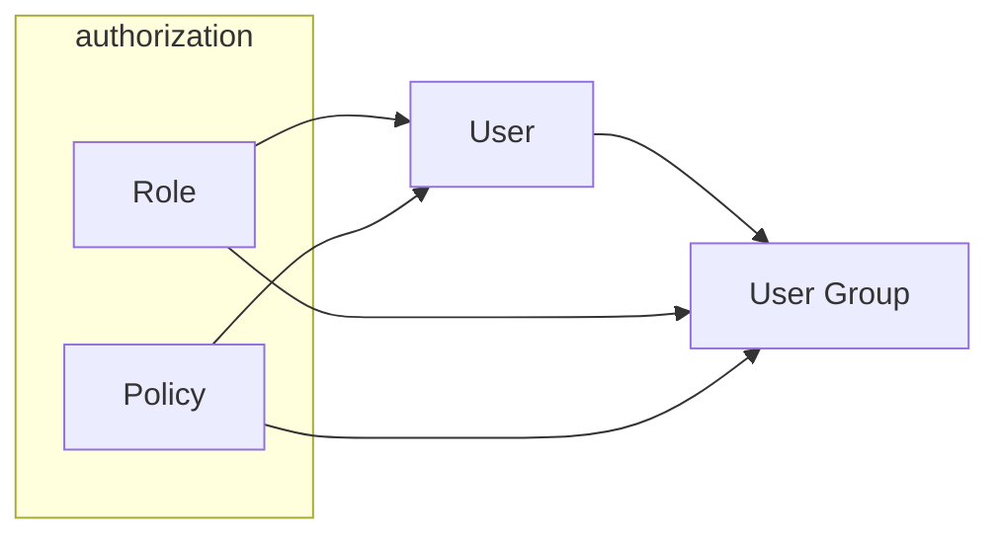

# Cue

# Summary

# Note
IAM creates and authenticate principals. 
IAM Authorize actions with policies attached to priciplas. 
Up to 5,000 users can be created. Users have no permissions by default.

## User Groups, Roles and Policies
