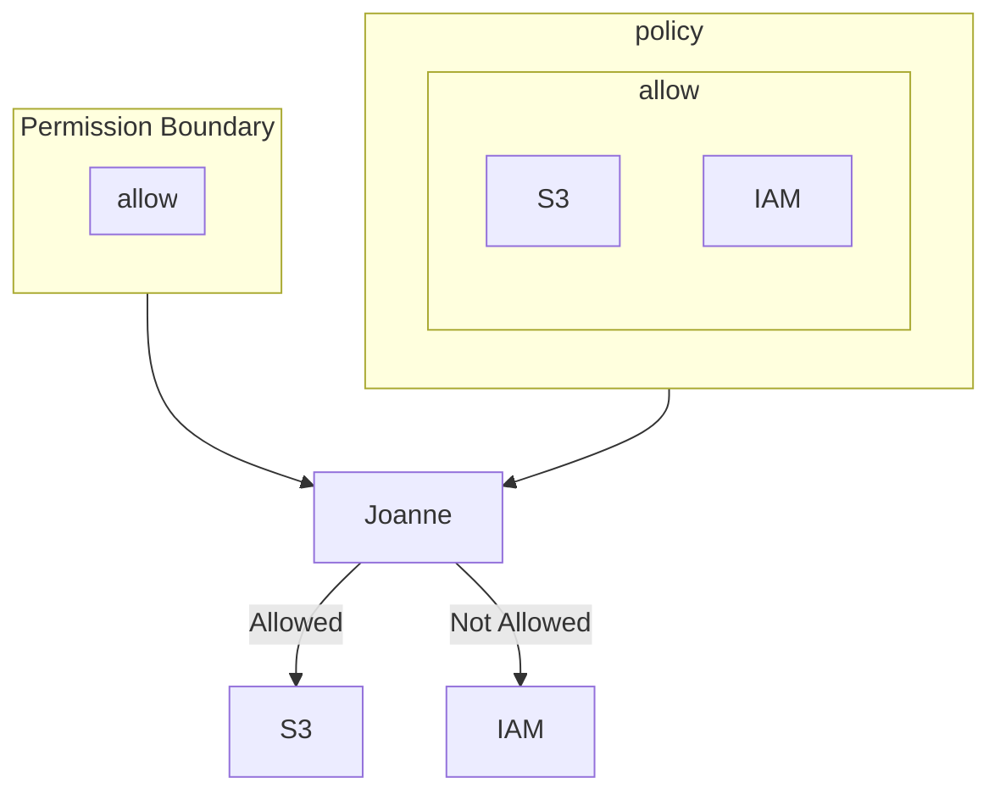

# Note

Permissions boundary restrict permissions. It can be attached to users and roles. 
Even when permssion for certain resource is allowed in policy, user or role cannot have that permission if it is not on permission boundary.

