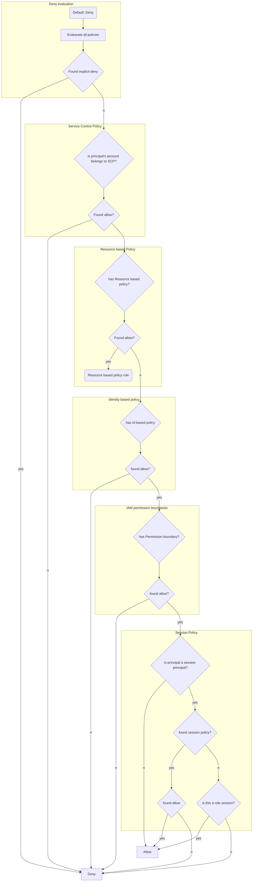

# Cue

# Summary

# Note


<hr >

## IAM Policy Structure
1. Version: version of IAM Policy Language
2. Statement: array of object with properties:
    1. Effect
    2. Action
    3. Resource

Note that 1st s3 resouce is for bucket and 2nd is for all objects in the bucket.
```JSON
"Version": "2012-10-17",
"Statement": [
    {
        "Effect": "Allow",
        "Action": [
            "s3:*",
            "dynamodb:Describe*",
            "dynamodb:List*",
            "dynamodb:GetItem"
        ],
        "Resource": [
            "arn:aws:s3:::mys3bucekt",
            "arn:aws:s3:::mys3bucket/*",
            "arn:aws:dynamodb:us-east-1:number:table/mytable"
        ]
    }
]
```

<hr />

## Evaluation Flow


