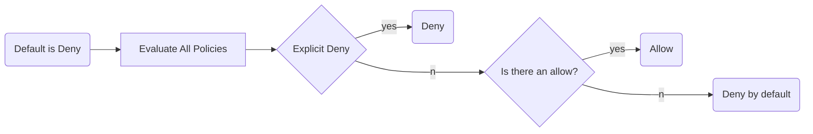

## Cue
1. what are recommended to use instead of ACL?
2. what policy should you use when you want centralized control?
3. what's the language of JSON writtenf for IAM Policy called?

## Note
### IAM Policy
- Identity based policies.
- written in JSON using the AWS access policy language
- Policies are attached to:
    - users
    - groups
    - roles

### Bucket Policy
- Only for S3 Buckets
- Use AWS access policy language

Policy looks like this: [[aws/basic/2|aws.s3.basic.Setting up]]

### S3 Access Control Lists (ALCS)
- Legacy mechanism
- Recommended to use Bucket Policies or IAM Policies instead
- ACL can be attached to a bucket or directly to an object.

### Which one to use?
- Use IAM Policy when you need centralized control
- Use Bucket Policy when you need simpler control

### Auth Process

## Summary
IAM Policy and Bucket Policy are encouraged to use instead of ACL. You can use the both and when there is deny for an action in either of the policy, it will be denied.