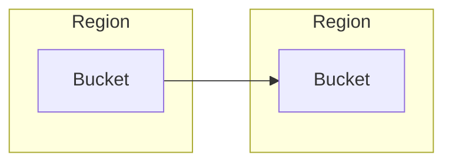
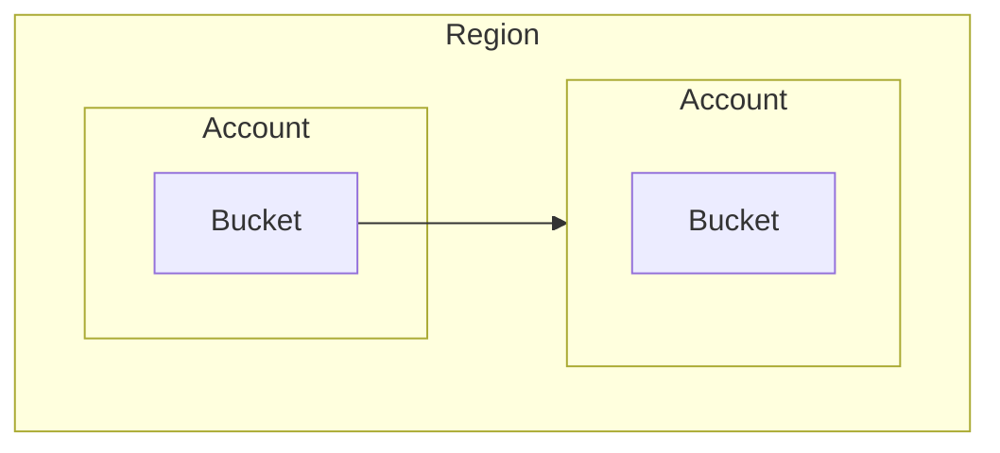
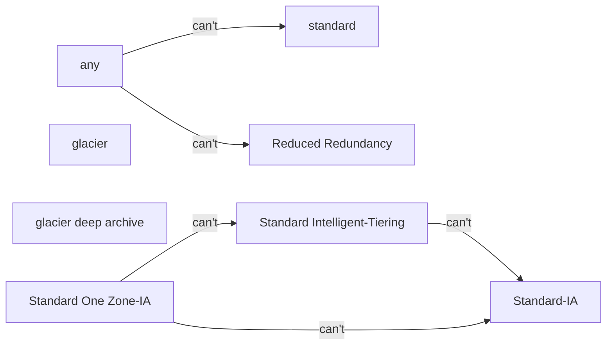

# Cue
1. which class cannot be transitioned to?
2. what class cannot be transitioned to from Intelligent-Tiering?
3. what classes cannot be transitioned to from One-Zone-IA

# Sumamry
Versioning could save you from accidental deletion and overwrite. Replication can be located either in the same or different region. 
No classes can transition to Standard or Reduced Redundancy. 
One-zone IA, Standard, and Intelligent tiering have limitation on transitioning.

# Note
## Versioning
- is a means of keeping variants of an object in the same bucket
- Versioning enabled buckets enables you to recover from;
    1. deletion
    2. overwrite

## Replication
!Versioning has to be enabled to use replication
### CRR (Cross Region Replication)

### SRR (Same Region Replication)

## Transitioning
- All classes cannot transition to S3 Standard or Reduced Redundancy
- Intelligent Tiering cannot transition to Standard-IA
- 1 Zone IA cannot transition to IA or Intelligent-Tiering

