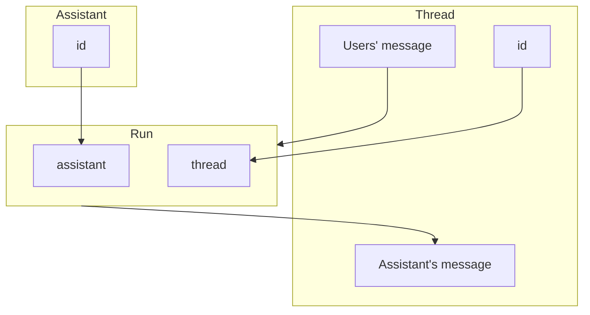

# Cue
1. enumerate the basic steps to work with assistant
2. enumerate the statuses of run
3. how can you add a message?
4. how can you retrieves messages?
5. how can you check the status of run?
6. how would you write a polling function?

<hr />

## Overview
Run uses the API to get assistant's message.
Run contains id of both Assistant and Thread.



## Basics
1. init openai
2. create a thread
3. create a run

user adds message,<br />
run retrieve message from the system.

``` javascript
const openaai = new OPEAI({apiKey: yourKey})

const thread = await openai.beta.threads.create()

async function addMessage(threadId, message){
    const res = await openai.beta.threads.messages.create(threadId, {
        role: "user",
        content: message
    })
    return res
}

async function runAssistant(threadId, assistant_id){
    const res = await openai.beta.threads.runs.create(threadId, {
        assistant_id: assistantId
    })
    return res
}

```
<hr />

## Polilng
In order to keep the status of the run up to date, you need to retrieve run object periodically.<br />! it may improve in the future.

1. make function to check status
    1. retrieve runObject
    2. check if status is completed
    3. if completed, clearInterval and get latest messages
    4. return messages
2. use setInterval and the function to implement the polling.

### Status
- queued --> in_progress of cancelling
- requires_action --> queued or expired
- in_progress -> completed, failed or expired
- cancelling -> cancelled


```javascript
let pollingInterval = setInterval(() => {
    checkStatus(res, threadId, runId)
}, 5000)

async function checkStatus(res, threadId, runId){
    const runObj = await openai.beta.treads.runs.retrieve(threadId, runId)

    const status = runObj.status

    if(status === 'completed'){
        clearInterval(pollingInterval)
        const messagesList = await openai.beta.threads.messages.list(threadId)
        
        let messages = []
        messagesList.body.data.forEach(message => {
            messages.push(message.content)
        })
        res.json({messages})
    }
}

```
